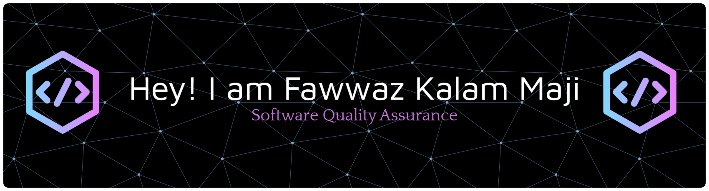

  

  

Hi there! I'm Fawwaz Kalam Maji, a fresh graduate with a Bachelor of Information Technology from Universitas Islam Indonesia. With experience in both application and website development, I am now focusing on building my career in Quality Assurance (QA). I have a solid foundation in manual and automated testing, along with a keen attention to detail, analytical skills, and teamwork.

Throughout my studies and hands-on projects, I have honed my skills in various programming languages like Java, PHP, SQL, and Python, as well as QA practices such as test case development, debugging, and software testing. I am passionate about ensuring the quality of software by identifying issues and improving functionality through comprehensive testing.

I'm eager to contribute to high-quality software projects and continuously improve my skills in QA. Check out my repositories where I share testing frameworks, bug tracking strategies, and my QA learning journey!

###

###

  
  
  
  
  
  
  
  
  

    
    
    
    

###

   
  

###

<picture>
  <source media="(prefers-color-scheme: dark)" srcset="https://raw.githubusercontent.com/fwzkalam/fwzkalam/output/pacman-contribution-graph-dark.svg">
  <source media="(prefers-color-scheme: light)" srcset="https://raw.githubusercontent.com/fwzkalam/fwzkalam/output/pacman-contribution-graph.svg">
  
</picture>

###
